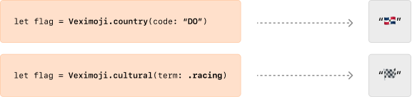

<p align="center" width="100%">
   
</p>

---

<p align="center" width="100%">
  Swiftly and safely convert ISO 3611 Alpha-2 country codes and cultural terms (such as <code><b>.pride</b></code> or <code><b>.racing</b></code>) to emoji flag strings without hassle.
</p>

<br />

<p align="center" width="100%">
   
</p>

<br />

From a developer's perspective, emojis are great. They're a large collection of natively supported and recognizable icons with a wide variety of use cases. They can enhance the visual appearance of labels and cells and do not require third-party dependencies.

Working with emojis in Swift is not as *swifty* as it could be, though.

## Installation

Package installation follows traditional conventions.

### Swift Package Manager

#### Manual Installation

Add **`package(url: "https://github.com/roz0n/Veximoji.git", from: "1.0.0")`**  to your application's **`Package.swift`** file.

#### Via Xcode

1. Open your project within Xcode and select **`File > Swift Packages > Add Package Dependency`** from the status bar menu.
2. Paste the HTTPS Github link: **`https://github.com/roz0n/Veximoji.git`** and click **`Next`**.
3. You'll be asked to define package options. **`Up to Next Major`**  is a safe default which accepts any version up to the next major release, click **`Next`** to proceed.

Once the package finishes downloading, should now see it listed in the Project Navigator on the left-hand pane. Likewise, feel free to select the project file, and **`Veximoji`** should be listed under the **`Swift Packages`**  tab. Xcode will also automatically add it to your main project target under the **"Frameworks, Libraries, and Embedded Content"** header.

### CocoaPods

Not yet available, but it's on the [**Roadmap**](#roadmap).

## Usage

Like emojis themselves, **`Veximoji`** is pretty lightweight. Every method contained within it is publicly exposed for convenience but you're most likely to interact with just two of them:

### `country(code:) -> String?`

- Used to render any given country's emoji flag by its two letter ISO 3611 Alpha 2 code
- Returns a string containing the corresponding flag emoji if the given country code is valid, otherwise returns **`nil`**
- There is no need to manually check the validity of the code as this method makes a call to **`validateISO3166(code:)`** already.
- For more information on ISO 3611 country codes visit [this Wikipedia article.](https://en.wikipedia.org/wiki/List_of_ISO_3166_country_codes)

#### Example

```swift
if let emojiFlag = Veximoji.country(code: "DO")  {
  print("\(emojiFlag)") // "🇩🇴"
}
```

### `cultural(named:) -> String?`

In the context of **`Veximoji`**, "cultural term" refers to an emoji flag that does not correspond to a country or region, but rather to a cultural reference, movement, or ideology. For example, **`.pride`** refers to the "rainbow" or "pride" flag.

**`Veximoji`** contains the correct Unicode scalars needed to accurately render each emoji flag within a publicly exposed dictionary:  **`culturalTermScalars: [CulturalTerms: [UInt32]]`**

- The dictionary is keyed by cases of the publicly exposed  **`CulturalTerms`** enum.
- The stored values of the dictionary are arrays of unsigned 32-bit integers, that when combined, compose the emoji character itself.

Currently, the **`CulturalTerms`** enum supports the following cases:

| Term  | Flag |
| ------------- | ------------- |
| `.pride`  | 🏳️‍🌈 |
| `.trans`  | 🏳️‍⚧️ |
| `.pirate`  | 🏴‍☠️ |
| `.white`  | 🏳️ |
| `.black`  | 🏴 |
| `.crossed`  | 🎌 |
| `.triangular`  | 🚩|
| `.racing`  | 🏁|

#### Example

```swift
if let prideEmojiFlag = Veximoji.cultural(named: .pride)  {
  print("\(prideEmojiFlag)") // "🏳️‍🌈"
}
```

### Helper Methods

#### `validateISO3166(code:) -> Bool`

- Returns a boolean indicating whether a given string is a supported ISO 3611 Alpha-2 country code by checking whether or not it is contained within the **`CFLocaleCopyISOCountryCodes`** collection.
- For more information on supported country codes visit the [**CFLocaleCopyISOCountryCodes**](https://developer.apple.com/documentation/corefoundation/1543372-cflocalecopyisocountrycodes) page in the Apple Developer Documentation.

##### Example

```swift
let dominicanRepublicCode = "do" // supports uppercase, lowercase, and mixed-case strings

if Veximoji.validateISO3166(code: dominicanRepublicCode)  {
  print("That code is valid")
} else {
  print("That code is invalid")
}
```

## Roadmap

- Add support for [exceptional reservations](https://en.wikipedia.org/wiki/ISO_3166-1_alpha-2#Exceptional_reservations)
- Add CocoaPods support

## License

MIT
